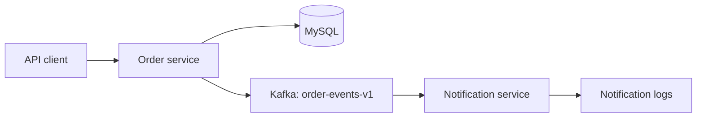
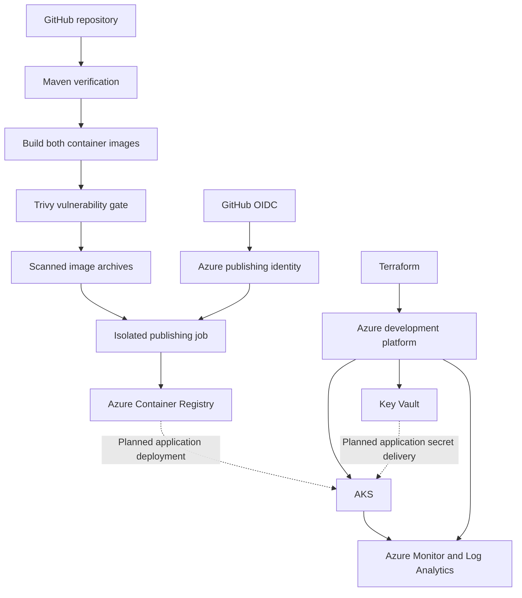

# Orderflow — Java Microservices on Azure

An event-driven order management project demonstrating Java development, container security, infrastructure as code, and cloud delivery practices.

Orderflow combines two Spring Boot services with MySQL and Kafka. Its Azure development platform is provisioned with Terraform, and GitHub Actions publishes tested and scanned container images to Azure Container Registry through passwordless OIDC authentication.

**Current status:** the AKS development platform and image publishing pipeline are operational. Deployment of the application workloads to AKS is the next milestone.

## Project at a glance

| Area | Implementation |
|---|---|
| Backend | Java 21, Spring Boot 4, Maven multi-module project |
| Services | Order service and notification service |
| Persistence | MySQL |
| Messaging | Apache Kafka |
| Local development | Docker Compose |
| Infrastructure | Terraform and Azure |
| Container platform | Azure Kubernetes Service |
| Image registry | Azure Container Registry |
| CI | GitHub Actions on GitHub-hosted runners |
| Authentication | GitHub OIDC and Azure managed identities |
| Security scanning | Trivy |
| Observability | Azure Monitor, managed Prometheus, and Log Analytics |

This repository targets a **development environment**. It demonstrates deliberate engineering choices and an incremental deployment process; it does not claim production readiness.

## Application behavior

The project models a small order-processing workflow:

1. A client sends a request to the order service.
2. The order service manages order data in MySQL.
3. Order creation and deletion produce events on Kafka.
4. The notification service consumes those events and logs a structured notification.

The notification service intentionally remains a logging demonstration. It does not send emails, SMS messages, or push notifications.

Events include identifiers and timestamps to make processing visible during testing and troubleshooting.



## What has been implemented

### Application and local development

- Two independently containerized Spring Boot services.
- Maven multi-module build.
- Root-level Docker Compose configuration.
- Non-root application users in runtime containers.
- Spring Boot Actuator health endpoints.
- Automated tests for application behavior and event handling.
- Local verification of order creation, deletion, and notification consumption.

### Azure development platform

Terraform provisions:

- Remote Terraform state storage.
- A development resource group in France Central.
- A virtual network, AKS subnet, and network security group.
- Azure Container Registry with administrator credentials disabled.
- Azure Key Vault with Azure RBAC and network access restrictions.
- An AKS cluster with Azure CNI Overlay and Cilium.
- Separate AKS control-plane and kubelet managed identities.
- Microsoft Entra authentication and Azure RBAC for cluster access.
- OIDC issuer and workload identity support.
- The Azure Key Vault Secrets Store CSI integration.
- Monitoring workspaces, collection rules, and alert configuration.

Key Vault infrastructure and AKS integration capabilities are enabled. Application secret delivery through that integration is part of the remaining workload deployment work.

### Container delivery

GitHub Actions:

- Runs Maven verification.
- Builds both service images.
- Scans operating-system packages and Java dependencies with Trivy.
- Blocks publication on HIGH or CRITICAL findings.
- Authenticates to Azure through OIDC.
- Publishes scanned images to ACR.
- Records image digests for later deployment.

### Observability

The platform collects:

- Kubernetes infrastructure metrics through managed Prometheus.
- Container logs, Kubernetes events, and pod inventory through Container Insights.
- Selected AKS control-plane logs through diagnostic settings.

Baseline alerts cover node readiness, kubelet scraping, missing telemetry, crash loops, and pending pods.

## Delivery architecture



Solid lines represent implemented capabilities. Dashed lines represent the application integration work still to be completed.

## CI workflow

The workflow is defined in [`.github/workflows/ci.yml`](.github/workflows/ci.yml).

| Trigger | Behavior |
|---|---|
| Pull request targeting `main` | Tests, image builds, and vulnerability scans |
| Push to `main` | Verification followed by ACR publishing when all required jobs succeed |

The publishing job has OIDC permission. Pull-request build and scan jobs do not receive Azure authentication privileges.

Images are built once per service within the container stage, scanned, exported, and transferred to the publishing job. Publishing loads those archives instead of rebuilding them.

Images receive full commit-SHA tags. The workflow also records immutable digest references:

```text
acrorderflowmarc2ndev1.azurecr.io/order-service@sha256:<digest>
acrorderflowmarc2ndev1.azurecr.io/notification-service@sha256:<digest>
```

GitHub Actions dependencies are pinned to commit SHAs, with Dependabot configured to propose updates.

SonarCloud analysis is optional. Its configured workflow submits analysis on `main`; it does not explicitly enforce a Sonar quality gate.

## Security and infrastructure decisions

| Decision | Purpose |
|---|---|
| GitHub OIDC | Avoid a long-lived Azure client secret in CI |
| Dedicated publishing identity | Scope CI access to image publication |
| Registry-scoped `AcrPush` | Grant publishing rights without subscription-wide permissions |
| Separate kubelet identity with `AcrPull` | Separate image consumption from publication |
| Non-root runtime containers | Reduce application runtime privileges |
| Trivy publication gate | Prevent known blocking findings from being published |
| Key Vault | Provide the planned application secret-management boundary |
| Restricted AKS API access | Limit administrative network access |
| Terraform-managed infrastructure | Make infrastructure changes reviewable and repeatable |

The networking design balances development cost and accessibility. ACR uses an authenticated public endpoint that standard GitHub-hosted runners can reach. This is not an entirely private-endpoint architecture.

Terraform does not manage application secret values as resources in the current implementation.

## Repository structure

```text
.
├── .github/
│   ├── dependabot.yml
│   └── workflows/
│       └── ci.yml
├── notification-service/
│   ├── Dockerfile
│   ├── pom.xml
│   └── src/
├── order-service/
│   ├── Dockerfile
│   ├── pom.xml
│   └── src/
├── infra/
│   ├── bootstrap/
│   └── platform/
├── .dockerignore
├── .env.example
├── .gitignore
├── compose.yaml
└── pom.xml
```

- **`infra/bootstrap`** provisions the Terraform state-storage foundation.
- **`infra/platform`** provisions the shared Azure development platform.
- **Service directories** contain application code, tests, and Dockerfiles.

## Run locally

### Prerequisites

- Git
- Java 21
- Maven
- Docker with Docker Compose support

Azure access is not required for local execution.

### Clone and configure

```powershell
git clone https://github.com/marc2n/orderflow-devops.git
Set-Location orderflow-devops

Copy-Item .env.example .env
```

Populate `.env` with the local configuration required by `.env.example`.

Keep `.env` out of version control.

### Run tests

```powershell
mvn -B -ntp clean verify
```

The test profiles use an in-memory database for order-service and disable Kafka listener startup. These tests complement the full local workflow checks; they do not replace database and broker integration testing.

### Build and start the stack

```powershell
docker compose config --quiet
docker compose up --build -d
docker compose ps
```

### Verify service health

```powershell
Invoke-RestMethod http://localhost:8081/actuator/health
Invoke-RestMethod http://localhost:8082/actuator/health
```

Both endpoints should report `UP`.

| Service | Local address |
|---|---|
| Order service | `http://localhost:8081` |
| Notification service | `http://localhost:8082` |

OpenAPI definitions are available locally at each service’s `/v3/api-docs` endpoint.

Use the order API to create and delete an order, then inspect the notification logs:

```powershell
docker compose logs --tail=100 notification-service
```

Expected application log entries include:

```text
eventType=ORDER_CREATED
eventType=ORDER_DELETED
```

### Stop the stack

```powershell
docker compose down
```

This command preserves named volumes. Removing volumes is a separate operation that deletes locally persisted data.

## Monitoring strategy

Metrics and logs have separate destinations:

| Data | Destination |
|---|---|
| Prometheus metrics | Azure Monitor workspace |
| Container logs | Log Analytics |
| Kubernetes events and inventory | Log Analytics |
| Selected control-plane logs | Log Analytics |

Development cost controls include selected log streams, 30-day Log Analytics retention, and a daily ingestion cap. The cap is not a hard spending ceiling and does not limit Prometheus charges.

## Validation achieved

The implementation has demonstrated:

- Successful Maven reactor verification.
- Healthy local containers for both services.
- Consumption of order-created and order-deleted events.
- Terraform deployment followed by a no-change plan.
- Ready AKS nodes and running monitoring agents.
- Prometheus metric ingestion and Log Analytics data arrival.
- A Prometheus smoke-test alert firing and invoking its action group.
- Successful GitHub OIDC authentication.
- Successful publication of both scanned service images to ACR.
